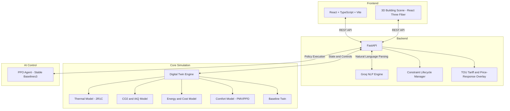

# JARVIS: HVAC Digital Twin and AI Control Simulator

JARVIS is a real-time HVAC digital twin for a 4-room building environment. It simulates
thermal dynamics, CO2/IAQ levels, energy cost, and occupant comfort, with an autonomous
reinforcement learning controller, a natural language complaint parser, and an interactive
3D visualization dashboard.

Live deployment: [jarvis-hvac.netlify.app](https://jarvis-hvac.netlify.app/)

---

## System Architecture



---

## Features

### Digital Twin Physics (`/digital_twin`, `/backend`)

- **Thermal model**: 2R1C grey-box equations per room. Explicit Euler steps account for HVAC
  power, neighbour room coupling, external weather, and occupancy heat loads.
- **CO2/IAQ model**: Per-room mass-balance CO2 (`dC/dt`). `iaq_score` maps CO2 ppm to 0-100.
  `overall_comfort_score = 0.7 * PMV_comfort + 0.3 * iaq_score`.
- **Energy and cost model**: Accumulates kWh and INR cost per step under the active tariff rate.
  Rolling 15-minute peak demand tracked alongside a parallel baseline twin for parity comparison.
- **Comfort model**: Fanger PMV/PPD comfort scoring per room.
- **Room layout**: 4 rooms in a 2x2 grid (A Conference, B Engineering, C Server, D Reception).
  Adjacency: A-B, A-C, B-D, C-D.

### Constraint Lifecycle

NLP complaints and IAQ rule violations create typed `ConstraintRecord` objects that go through a
full lifecycle:

- **active**: constraint applied as a setpoint/airflow delta overlay.
- **resolved**: PMV or CO2 returned to acceptable range within the time window.
- **renewed**: first failure triggers a 1.5x delta renewal.
- **escalated**: second failure escalates and clears the constraint.

Physics-derived deltas are used for thermal actions (based on current PMV magnitude). Expiry
duration maps from urgency: high = 45 min, medium = 30 min, low = 20 min (simulated time).

Endpoints: `GET /api/constraints`, `POST /api/constraints/{id}/react`.

### Time-of-Use Tariff and Price-Response Overlay

Default TOU schedule (INR/kWh):

| Window | Rate |
|--------|------|
| 00:00 - 06:00 | 4.0 |
| 06:00 - 14:00 | 6.0 |
| 14:00 - 20:00 | 9.0 (peak) |
| 20:00 - 24:00 | 6.0 |

- **Pre-cool**: 60 minutes before peak, setpoint bias of -1.0 C applied.
- **Peak relax**: during peak window for occupied rooms, setpoint relaxed by +1.5 C.
- **Comfort guard**: bias is smoothly reduced to keep PMV within [-0.7, +0.7] at all times.

Endpoints: `GET /api/environment/tariff`, `POST /api/environment/tariff`,
`POST /api/environment/force-peak`.

### NLP Complaint Parser

`POST /api/chat/message` accepts free-text occupant complaints and routes them to the Groq LLM
(configurable via `GROQ_MODEL` env var, default `llama-3.3-70b-versatile`). The engine resolves:

- Thermal complaints (hot/cold) and airflow complaints (stuffy/drafty).
- Room synonyms: "boardroom" -> A, "dev pit" -> B, "server room" -> C, "front lobby" -> D.
- Explicit setpoint commands: "set room A to 23 C".
- Sarcasm and multilingual input (Spanish, French, Hindi/Hinglish tested).
- Out-of-scope non-HVAC complaints (furniture, noise, lighting, IT, pantry) are rejected with
  `action: none`.

Evaluation harness: `tools/nlp_eval.py` against 45 labeled cases in `docs/nlp_eval_cases.json`.
Benchmark: 100% intent accuracy, 100% room accuracy, 100% out-of-scope rejection (live Groq run,
45/45).

### Reinforcement Learning (`/rl`)

A PPO agent (`stable-baselines3`) trained to balance occupant comfort and energy efficiency.
Toggle between manual control and autonomous RL policy via the dashboard or the API.

Endpoint: `POST /api/simulation/rl-mode`.

### 3D Visualization Dashboard (`/frontend`)

Built with React 19, Vite, TypeScript, React Three Fiber, and Drei.

- **3D building scene**: four room volumes in a 2x2 grid with real furniture models (Kenney CC0
  kit) and animated occupant avatars (Quaternius CC-BY), toggled from the 2D floor-plan view.
- **Live visual wiring**: room floor tint from temperature, CO2 haze volume, airflow particle
  stream, constraint beacon (amber active / orange renewed / red escalated), ceiling vent glow
  for TOU price-response.
- **Click-to-select**: clicking a room in 3D synchronizes the dashboard selected room panel.
- **Parity charts**: cumulative cost vs baseline cost, energy vs baseline, 15-minute peak demand,
  and comfort parity over time.
- **Demo macros**: Force Peak Price, Stuffy Room B, Heat Wave, Reset Defaults.
- **NLP chat panel**: send complaints directly from the dashboard.

---

## Getting Started

### Prerequisites

- Python 3.9+
- Node.js 18+
- A [Groq API key](https://console.groq.com/) for the NLP engine.

### Backend Setup

1. Install Python dependencies from the project root:
   ```bash
   pip install -r backend/requirements.txt
   ```

2. Create a `.env` file (use `.env.example` as a template) and set your Groq API key:
   ```
   GROQ_API_KEY=your_key_here
   ```

3. Start the FastAPI server:
   ```bash
   uvicorn backend.main:app --reload
   ```

### Frontend Setup

1. Navigate to the frontend directory:
   ```bash
   cd frontend
   ```

2. Install dependencies (include dev dependencies so the build tools are available):
   ```bash
   npm install --include=dev
   ```

3. Start the Vite development server:
   ```bash
   npm run dev
   ```

---

## Running Tests

Backend unit tests (50 tests across IAQ, constraint lifecycle, and TOU price-response):

```bash
python -m pytest backend/tests -q
```

NLP evaluation harness (45 labeled cases, offline deterministic mode):

```bash
python tools/nlp_eval.py --mode mock
```

To run against the live Groq API (requires `GROQ_API_KEY` in `.env`):

```bash
python tools/nlp_eval.py --mode live
```

Digital twin physics validation (generates plots in `digital_twin/plots/`):

```bash
python digital_twin/simulation_demo.py
```

---

## Training the RL Agent

```bash
python -m rl.train --timesteps 1000000
```

Outputs a `.zip` model to `rl/models/`. Load it from the dashboard or via
`POST /api/simulation/rl-mode` with `{"mode": "auto", "model_path": "rl/models/..."}`.

---

## Project Structure

```
jarvis/
├── backend/            FastAPI application, simulation manager, NLP engine
│   ├── tests/          Unit tests (IAQ, constraints, TOU price-response)
│   ├── digital_twin.py Building twin and snapshot logic
│   ├── simulation_manager.py  Constraint lifecycle, overlays, TOU tariff
│   ├── nlp_engine.py   Groq LLM complaint parser
│   └── main.py         API routes
├── digital_twin/       Standalone grey-box physics package
├── docs/               NLP evaluation cases and report, phase documentation
├── frontend/           React + R3F dashboard
│   └── src/
│       ├── components/ BuildingScene3D, charts, panels, demo macros
│       └── App.tsx
├── rl/                 PPO training pipeline and saved policies
├── tools/              nlp_eval.py evaluation harness
├── Dockerfile          Backend container (python:3.11-slim, CPU-only torch)
└── netlify.toml        Frontend deployment config
```

---

## Deployment

- **Backend**: Docker container deployable to Render or Koyeb.
  ```bash
  docker build -t jarvis-backend .
  docker run -p 8000:8000 -e GROQ_API_KEY=your_key jarvis-backend
  ```
- **Frontend**: Netlify (SPA fallback configured in `netlify.toml`). Set `VITE_API_URL` to your
  backend URL.

---

## Asset Credits

See [CREDITS.md](./CREDITS.md) for full attribution. Furniture models are Kenney (CC0). Occupant
avatars are Quaternius characters from poly.pizza (CC-BY).
