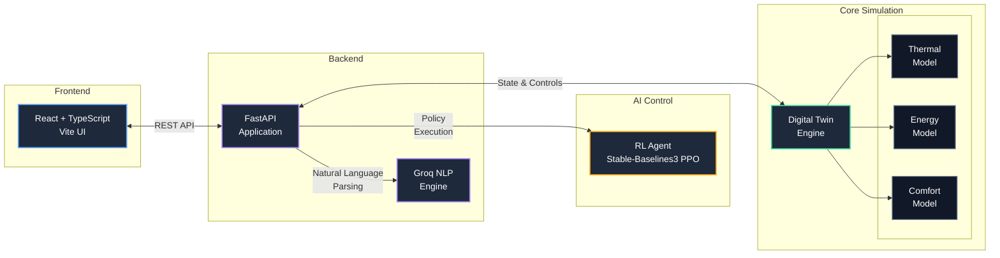
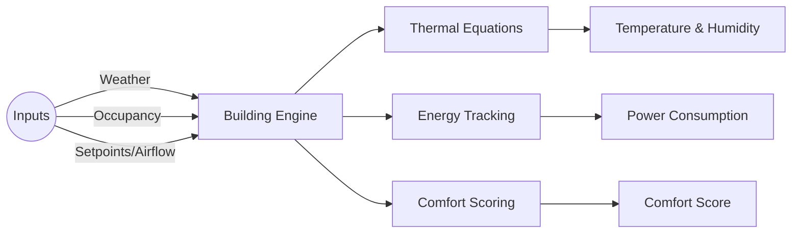

# JARVIS: HVAC Digital Twin & AI Control Simulator

JARVIS is a comprehensive, simplified grey-box thermal digital twin simulator for a 4-room building environment. It provides a real-time platform to simulate thermal dynamics, energy consumption, and human comfort, alongside a reinforcement learning (RL) agent capable of autonomous HVAC control and a natural language processing (NLP) interface for user complaints.

## UI Preview

You can view the live frontend application here: [JARVIS HVAC Digital Twin](https://jarvis-hvac.netlify.app/)

## System Architecture

*(The following architecture and flowcharts are written in Mermaid.js syntax. When viewing this README on GitHub, GitLab, or in VS Code with a Markdown preview, these blocks will automatically render as accurate, non-hallucinated diagrams based directly on the code!)*


The repository is modularized into four primary components:



### 1. Digital Twin (`/digital_twin`)
The core physics engine, written in pure Python. It simulates building dynamics deterministically without relying on external heavy tools like EnergyPlus.
*   **Building Model**: Manages states of the 4 rooms and tracks total energy.
*   **Thermal Model**: Computes temperature changes based on HVAC power, external weather, and internal occupancy loads.
*   **Energy Model**: Tracks accumulated energy consumption (kWh) based on HVAC activity.
*   **Comfort Model**: Calculates a comfort score based on temperature deviations from ideal setpoints.



### 2. Backend (`/backend`)
A FastAPI server acting as the bridge between the core simulation, the frontend UI, and external AI models.
*   **Simulation Control**: Start, pause, reset, and adjust simulation speed.
*   **Hardware Injection**: Endpoints to inject real sensor data, anchoring the digital twin to reality.
*   **NLP Engine**: Uses the Groq LLM API to process natural language complaints (e.g., "It's too hot in room A1") and translate them into simulation constraints.
*   **RL Mode Manager**: Toggles between manual UI control and autonomous RL policy control.

### 3. Reinforcement Learning (`/rl`)
Trains a Proximal Policy Optimization (PPO) agent to optimize HVAC controls.
*   Balances two competing objectives: maximizing occupant comfort and minimizing energy consumption.
*   Built using `stable-baselines3`.
*   Includes training scripts, custom Gym environments, and policy evaluation tools.

### 4. Frontend (`/frontend`)
A modern, responsive dashboard built with React, Vite, and Recharts.
*   Visualizes real-time room temperatures, setpoints, and comfort scores.
*   Provides manual control over HVAC parameters.
*   Includes a chat interface to communicate with the NLP engine.

## Getting Started

### Prerequisites
*   **Python 3.9+**
*   **Node.js 18+**

### Backend Setup
1. Navigate to the root directory and install Python dependencies:
   ```bash
   pip install -r backend/requirements.txt
   ```
2. Set up your environment variables (create a `.env` file based on `.env.example` if applicable, ensuring you provide a `GROQ_API_KEY` for the NLP engine).
3. Start the FastAPI server:
   ```bash
   uvicorn backend.main:app --reload
   ```

### Frontend Setup
1. Navigate to the `frontend` directory:
   ```bash
   cd frontend
   ```
2. Install dependencies:
   ```bash
   npm install
   ```
3. Start the Vite development server:
   ```bash
   npm run dev
   ```

##Simulation Demo & Validation

To run standalone validation scenarios and generate plots for the Digital Twin physics:
```bash
python digital_twin/simulation_demo.py
```
This runs 6 deterministic scenarios (Cooling, Heating, Disturbances) to validate thermal dynamics and bounds. (Requires `matplotlib` to generate plots in `digital_twin/plots/`).

## Training the RL Agent
To train a new PPO policy for the HVAC system:
```bash
python -m rl.train --timesteps 1000000
```
This outputs a `.zip` model in the `rl/models/` directory, which can be loaded by the backend to run in Auto Mode.
